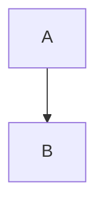

# Final Project Report

* Student Name: Peter Idoko
* Github Username: pidoko
* Semester: Fall 2023
* Course: CS 5001

latex math
$ n^2 $ hello in-line notation
$$ n^2 $$
hello

## Description 
I created a password generator that supports automatic or user generation.For the automatic generator, the passwords have a minimum of 12 characters and for the user generated passwords there are multiple checks to ensure a minimum entropy of 72.

I completed this project because I use 1Password everyday and I am interested in how they created they password generator feature.

## Key Features
Key features include a check against a password dictionary containing 1 million of the most common online passwords to ensure that the user does not create one of those passwords. 

Another feature is the entropy calculation provided at the end which is a measure of the password complexity based on the number of permutations. Also, there is another calculation for the estimated time to crack the password using a brute-force algorithm that completes password attemps at a frequency of 3.5GHz.

There are six checks when the user is typing their password to ensure that they create a password of at least an entropy of 72. These checks are for the lack of uppercase letters, lowercase letters, numbers, special characters, minimum length of 12, and uniqueness. 

## Guide
How do we run your project? What should we do to see it in action? - Note this isn't installing, this is actual use of the project.. If it is a website, you can point towards the gui, use screenshots, etc talking about features. 

## Installation Instructions
If we wanted to run this project locally, what would we need to do?  If we need to get API key's include that information, and also command line startup commands to execute the project. If you have a lot of dependencies, you can also include a requirements.txt file, but make sure to include that we need to run `pip install -r requirements.txt` or something similar.

## Code Review
Go over key aspects of code in this section. Both link to the file, include snippets in this report (make sure to use the [coding blocks](https://github.com/adam-p/markdown-here/wiki/Markdown-Cheatsheet#code)).  Grading wise, we are looking for that you understand your code and what you did. 

### Major Challenges
Key aspects could include pieces that your struggled on and/or pieces that you are proud of and want to show off.

## Example Runs
Explain how you documented running the project, and what we need to look for in your repository (text output from the project, small videos, links to videos on youtube of you running it, etc)

## Testing
How did you test your code? What did you do to make sure your code was correct? If you wrote unit tests, you can link to them here. If you did run tests, make sure you document them as text files, and include them in your submission. 

I created a test file and ran tests for edge cases to ensure the code was correct. 
> _Make it easy for us to know you *ran the project* and *tested the project* before you submitted this report!_

## Missing Features / What's Next
Focus on what you didn't get to do, and what you would do if you had more time, or things you would implement in the future. 

## Final Reflection
Write at least a paragraph about your experience in this course. What did you learn? What do you need to do to learn more? Key takeaways? etc.